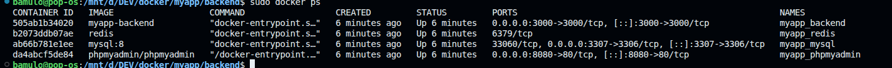
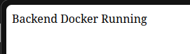
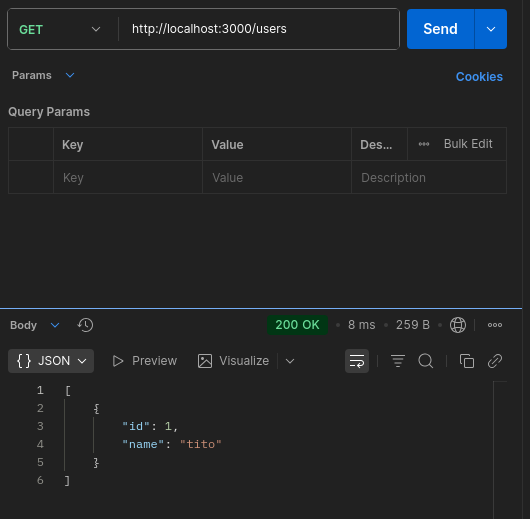

# Laporan Hasil Praktikum: Final Project Aplikasi Berbasis Container

## Identitas Mahasiswa

- **Nama:** Tito Putra Bamulo
- **NIM:** 2415354011
- **Kelas/Rombel:** TRPL C
- **Tanggal Praktikum:** 20 Mei 2026

---

## Teknologi & Tools yang Digunakan

- **Sistem Operasi:** Linux (Pop os)
- **Containerization:** Docker & Docker Hub
- **Bahasa Pemrograman / Framework:** Node.js
- **Tools Lain:** VS Code, Git, Postman

---

## Langkah 1: Run docker compose

```bash
# Contoh perintah terminal yang dijalankan
sudo docker compose up -d -- build (untuk compose file docker-compose.yml yang sudah di configurasi)
sudo docker ps (untuk melihat apakah container yang di buat sudah berjalan)
```

**Dokumentasi/Screenshot:**



---

### Langkah 2: CRUD using postman





---

### Langkah 3: Check Docker images and volume


## Kesimpulan

Docker sangat berguna dalam pembuatan software terutama dalam pembuatan bersama tim untuk meyamakan dependency
